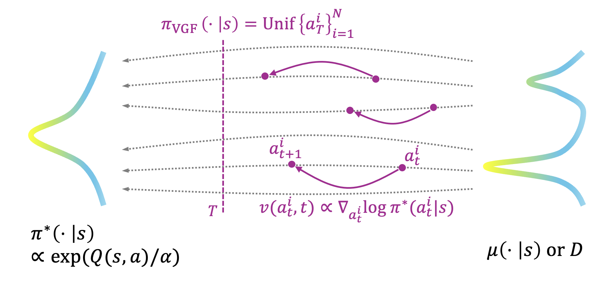

<div align="center">

<div id="user-content-toc" style="margin-bottom: 50px">
  <ul align="center" style="list-style: none;">
    <summary>
      <h1>Value Gradient Flow</h1>
      <!-- <br> -->
      <!-- <h2><a href="https://arxiv.org/abs/2502.02538">Paper</a> &emsp; <a href="https://seohong.me/projects/fql/">Project page</a></h2> -->
    </summary>
  </ul>
</div>




</div>

<!-- ## Overview

Flow Q-learning (FQL) is a simple and performance data-driven RL algorithm
that leverages an expressive *flow-matching* policy
to model complex action distributions in data. -->

## Installation

To install the full dependencies, simply run:
```bash
pip install -r requirements.txt
```
To use D4RL environments, you need to additionally set up MuJoCo 2.1.0.

## Usage

Paper results can be reproduced by running `./run_scripts/run_vgf_off_d4rl.sh`, `./run_scripts/run_vgf_off_ogbench.sh`, `./run_scripts/run_vgf_off2on_ogbench.sh`.

Wandb runs can be found at [here](https://wandb.ai/ryanxhr/vgf_camera_ready_off2on?nw=nwuserryanxhr)

## Acknowledgments

This codebase is built on top of [fql](https://github.com/seohongpark/fql)'s reference implementations.
